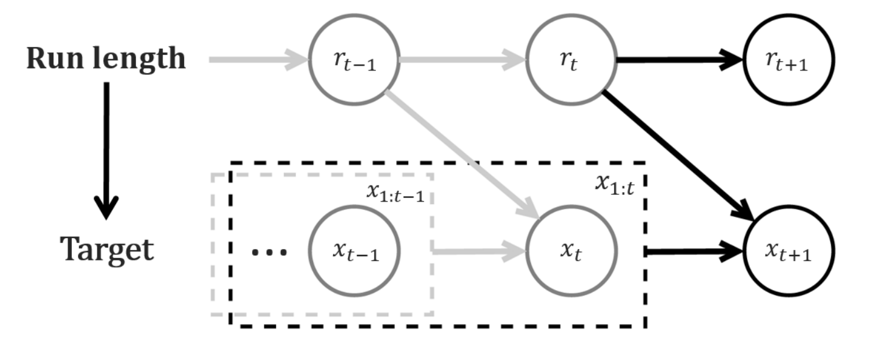

---
author:
- "Hamza FILALI"
bibliography: "../references/bocpd_references.bib"
date: March 2022
nocite: "[@*]"
title: Notes on Bayesian Online Change Point Detection
toc: true
toc_sticky: false
full-width	: true
classes: wide
tags: ["bayesian", "change-point", "online change-point"]
comments: true
date: 2022-09-04
---

In this post I am going to delve into the mathematical details behind the graphical model *Bayesian Online
Change Point Detection* introduced in .
This model can be used to detect different type of change-points and has known many extensions over the last few years.\
Given a time series, we are interested in detecting structural changes
as new data comes in [^1].\
A great explanation of this paper can be found in .\
You might ask, why reading this post then? There is three main reasons.\
First, I will try to clarify parts that were not trivial to me despite
reading the paper and the post above (e.g. a tiny mistake was made in the math
derivation).\
Second and most importantly the paper only provides a way to calculate
the probability that there was a change-point k units of time ago, but
it does not propose a strategy to segment the time-series. I will
suggest an algorithm to perform an optimal segmentation at a given time t.
Finally, I will show how we can use BOCPD to detect trend changes.

<figure>

<figcaption align = "center"><b>Graphical model associated to BOCPD. Source
</b></figcaption>
</figure>

# BOCPD

Let $$\{x_{1}, ... x_{T}\}\in \mathbf{R}^{T\times d}$$ denote the time
series of interest.

## Introducing the main ingredient: Run-length

Let $$r_{t}$$, the *run-length*, be a random variable that represent the
time since the last change-point. For instance, $$r_{t} = j$$ implies that
the last change-point was at time t-j.\
It follows that $$r_{t} \in \mathbf{R}^{t}$$ and $$ r_{t} = \begin{cases}
0 \text{     if change-point at time $t$} \\
r_{t-1} + 1 \text{     else} \end{cases}$$

\
In the BOCPD model, our main interest lies in calculating the run-length
posterior distribution $$P(r_{t}|x_{1:t})$$.\
In order to do compute it we need to make some assumptions around:

1.  the conditional dependence structure between $$\{x_{1}, ... x_{T}\}$$
    and $$\{r_{1}, ... r_{T}\}$$

2.  the underlying distribution of $$\{x_{1}, ... x_{T}\}$$ and
    $$\{r_{1}, ... r_{T}\}$$

## Conditional dependence structure assumptions

The assumptions that we are going to explain in more details are
outlined in the <a href="#graphicalmodel">graphical representation above</a>.

<ins>Assumption 1:</ins> We assume that $$r_{t}$$ is conditionally
independent of everything else given $$r_{t-1}$$. In particular, $$P(r_{t} | r_{t-1}, x_{1:t}) = P(r_{t} | r_{t-1})$$\

<ins>Assumption 2:</ins> We assume that the current observation only
depends on the past observations associated to the current partition
defined be the run-length, i.e.
$$P(x_{t} | r_{t-1}=r, x_{1:t-1}) = P(x_{t} | x_{t-r-1:t-1})$$

With these two assumptions, we can derive our main objective
$$P(r_{t}|x_{1:t})$$.\
Given that $$P(r_{t}|x_{1:t}) = \frac{P(r_{t},x_{1:t})}{\sum_{r'_{t}}P(r'_{t},x_{1:t})}$$,
we just need to solve for $$P(r_{t},x_{1:t})$$. 

$$\begin{aligned}
P(r_{t},x_{1:t}) =& \sum_{r_{t-1}} P(r_{t}, r_{t-1}, x_{1:t})  \text{      (by marginalizing over $r_{t-1}$)}\\ =& \sum_{r_{t-1}} P(r_{t}, x_{t} | r_{t-1}, x_{1:t-1})P(r_{t-1}, x_{1:t-1}) \text{     (by bayes rule)}\\ =&  \sum_{r_{t-1}} P(r_{t}| x_{t} , r_{t-1}, x_{1:t-1})  P( x_{t} | r_{t-1}, x_{1:t-1}) P(r_{t-1}, x_{1:t-1}) \text{      (by bayes rule)} \\ =&  \sum_{r_{t-1}} P(r_{t}|  r_{t-1})  P( x_{t} | r_{t-1}, x_{t-1- r_{t-1}:t-1}) P(r_{t-1}, x_{1:t-1}) \quad \text{ (by assumption 1 and 2)}
\end{aligned}$$\
Three terms appear in the equations above:

$$P(r_{t},x_{1:t}) = \sum_{r_{t-1}} \underbrace{P(r_{t}|  r_{t-1})}_{\text{Change-point Prior}}   \underbrace{P( x_{t} | r_{t-1}, x_{t-1- r_{t-1}:t-1})}_{\text{Predictive Model}} \underbrace{P(r_{t-1}, x_{1:t-1})}_{\text{Message}}$$\
We now need to make assumptions on the distribution of the Change-point
Prior and the Underlying Predictive Model in order to be able to
recursively derive the run-length posterior.

## Underlying distribution assumptions

### Change-point prior model

The transition probability $$P(r_{t}|r_{t-1})$$ is assumed to follow the
below distribution: 

$$P(r_{t}|r_{t-1}) = \begin{cases}
H(r_{t-1} + 1) \quad \text{if   } r_t = 0
\\
1 - H(r_{t-1} + 1) \quad \text{if }r_t = r_{t-1} + 1
\\
0 \quad \text{otherwise}
\end{cases}$$ 

where  $$H(\tau) = \frac{p_{g}(\tau)}{\sum_{t=\tau}^{\infty}p_{g}(t)}$$ is the
hazard function[^2] and $$p_{g}(t)$$ represents the probability of a
segment of length t. 

If we set $$p_{g}$$ to follow a geometric
distribution with parameter $$\lambda$$ then
$$H(\tau) = \frac{1}{\lambda}$$. 
The prior $$\lambda$$ encodes our belief on
the expected length of a segment, in other words our prior on the
average length of a partition.

### Predictive Model assumptions

The last part we need to compute is the predictive probability
$$P( x_{t} | r_{t-1}, x_{t-1- r_{t-1}:t-1})$$.\
\
<ins>Assumption 3:</ins> We assume that $$x_{t}$$ follows a
distribution with parameter $$\eta$$ (where $$\eta$$ is a random quantity in
a bayesian framework). $$\eta$$ is shared across all the $$x_{i}$$ within a
segment (defined by the run-length).

Given our new point, we are trying to estimate the probability that this
new point belongs to the current partition: 
$$P( x_{t} | r_{t-1}, x_{t-1- r_{t-1}:t-1}) = \int P( x_{t} | \eta, r_{t-1}, x_{t-1- r_{t-1}:t-1}) P( \eta | r_{t-1}, x_{t-1- r_{t-1}:t-1})d \eta$$\
\
<ins>Assumption 4:</ins>
$$x_{t} \perp\kern-5pt\perp  r_{t-1}, x_{t-1- r_{t-1}:t-1} |\eta$$.\
\
Under this assumption, we obtain:

$$P( x_{t} | r_{t-1}, x_{t-1- r_{t-1}:t-1}) = \int \underbrace{P( x_{t}| \eta)}_\text{underlying model}  \underbrace{P( \eta | r_{t-1}, x_{t-1- r_{t-1}:t-1})}_{\text{Posterior Distribution}}d \eta$$\
We now need to define the underlying distribution of our time series and the
distribution of the prior $$\eta$$.

The law $$x_{t} | \eta$$ that we choose defines the type of change-points
we wish to detect.\
If we are interested in detecting abrupt shifts in the mean, we could
then choose a Gaussian distribution.\
If we have count data, we could be tempted to choose a Poisson
distribution. If we have are interested in changes in the trend, we
could choose a Bayesian linear regression with time as a regressor.\
\
In , $$ x_{t}| \eta$$ is restricted to come from
the Exponential Family and the prior $$P(\eta)$$ is restricted to be a
conjugate prior (which means that
$$P( \eta | r_{t-1}, x_{t-1- r_{t-1}:t-1})$$ and $$P(\eta)$$ come from the
same family distribution).\
\
The choice of Exponential family + conjugate prior is motivated by a
trade-off between tractability of the equations and generalization over
the type of change-points that can be detected:

1.  The conjugate prior allows for a tractable derivation of the
    posterior distribution as we obtain a closed-form of the posterior
    distribution. The main derivation needed is on the hyper-parameters
    associated with the posterior distribution. In the case of an
    Exponential Family likelihood, the hyper-parameters have an easy
    formula that can be updated sequentially, a very appealing property
    in the case of sequential learning.

2.  The Exponential Family encompasses a lot of widely used family for
    change-point detection problems (e.g. normal distribution, poisson
    distribution, bayesian linear regression\...).

3.  Most of the exponential family distributions lead to a closed form
    of the predictive probability when the prior is conjugate, which
    avoids us to resort to bayesian approximation techniques that are
    computationally costly.

# How can we use the output of BOCPD to detect changes?

## An offline strategy: a viterbi-like algorithm

A natural criteria to find the best segmentation up until time t is to
find the Maximum A Posteriori sequence of run-length, i.e. the most
probable sequence of run-length:

$$r^{*}_{1}, ... r^{*}_{t} = arg \max\limits_{r_{1}, ... r_{t}} P(r_{1}, ... r_{t} | x_{1}, ..., x_{t})$$

By noticing that:  $$arg \max\limits_{r_{1}, ... r_{t}} P(r_{1}, ... r_{t} | x_{1}, ..., x_{t}) =  arg \max\limits_{r_{1}, ... r_{t}} P(r_{1}, ... r_{t} , x_{1}, ..., x_{t})$$
We will optimize $$P(r_{1}, ... r_{t} , x_{1}, ..., x_{t})$$ through a dynamic programming algorithm.

This optimization formulation is the same as the Viterbi Algorithm used
for Hidden Markov Models.However, the structural dependencies are slightly different, hence the
recursion is slightly different. 

Figure <a href="#graphicalmodel">1</a> illustrates the structural dependencies assumptions in BOCPD, which are used in the last line of the equation below.

$$\begin{aligned}
    P(r_{1}, ..., r_{t} , x_{1}, ..., x_{t}) =& P( r_{t} | r_{1}, ..., r_{t-1}, x_{1}, ..., x_{t}) P(r_{1}, ..., r_{t-1}, , x_{1}, ..., x_{t}) \\ =& P( r_{t} | r_{1}, ..., r_{t-1}, x_{1}, ..., x_{t}) P( x_{t} | r_{1}, ..., r_{t-1}, x_{1}, ..., x_{t-1}) P(r_{1}, ..., r_{t-1} , x_{1}, ..., x_{t-1})
    \\ =& P( r_{t} | r_{t-1}) P( x_{t} | r_{t-1}, x_{1}, ..., x_{t-1}) P(r_{1}, ..., r_{t-1} , x_{1}, ..., x_{t-1})
\end{aligned}$$

Now let's introduce a few notations:\
Let
$$\delta_{t}(j) \overset{\Delta}{=}  \log P(r_{1}, ..., r_{t}=j, x_{1}, ..., x_{t})$$.\
Let $$A(i,j)  \overset{\Delta}{=} \log P(r_{t}=j|r_{t-1}=i)$$.\
Let
$$\lambda(i)  \overset{\Delta}{=} \log P( x_{t} = i| r_{t-1}, x_{1}, ..., x_{t-1})$$.

Using the equation above, we get:\
$$\delta_{t}(j) = \max\limits_{i} A(i,j) + \lambda(i) +\delta_{t-1}(i)$$

This recursion above allows us to compute the optimal sequence of
run-length at each time step.\
An important drawback is the time and space complexity of this
algorithm. The space complexity is $$O(T^{2})$$ while the computational complexity is
$$O(T)$$.

## An online strategy

In the online change-point setting, we are above all interested in
detecting a new change-point with minimum delay (more than finding
retrospectively the optimal segmentation).\
An easy and natural strategy would be to detect an alert if the
run-length posterior distribution
$$P(r_{t} = l| x_{1}, ..., x_{t}) > \text{threshold}$$.\
There is two parameters to consider here. 
The parameter $$l$$ directly encodes the detection delay with which we will flag a change-point. 
The threshold encodes the confidence degree with which we will flag a
change-point.\
One issue with this methodology is that we will generally detect
multiple consecutive change-points.

[^1]: Online detection is opposed to Offline change-point detection. In
    the offline case, we are interested in identifying structural
    changes after observing the entire time series. The online case aims
    at identifying structural changes as new observations come in.

[^2]: A term coming from the field of survival analysis

# References



